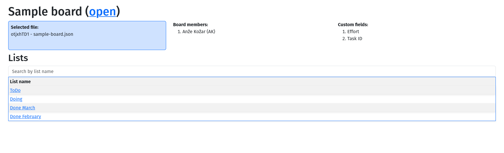
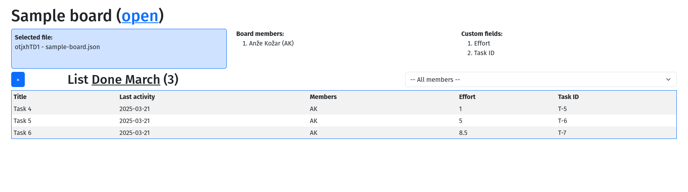

# Trello json export parser/visualizer
A tool to enable HTML table visualization of a Trello board JSON export.

## How to use:
1. Export a Trello board to JSON (Menu -> Print, export and share -> Export as JSON)
2. Visit https://nzkozar.github.io/trello_board_visualizer/ or open index.html in your favourite browser (tested in Firefox)
3. Drag and drop jour Trello board JSON export to the file drop area.

## Dependencies and libraries
This project uses the following 3rd party libraries:

- jQuery (https://jquery.com/)
- Bootstrap 5 (https://getbootstrap.com/)
- moment.js (https://momentjs.com/)